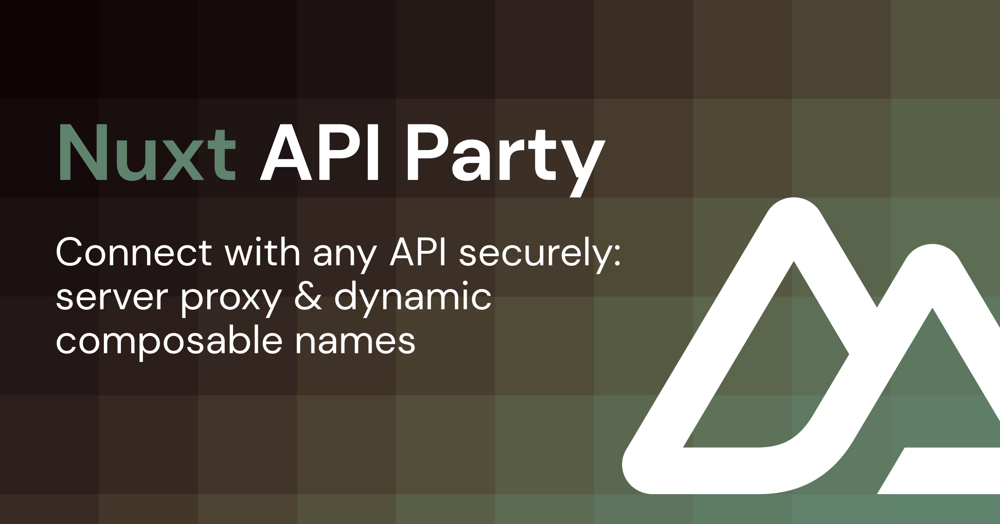

# nuxt-api-party

[](https://www.npmjs.com/package/nuxt-api-party)

This module enables you to securely fetch data from any API by proxying the request in a Nuxt server route. Composable names are dynamic – given `json-placeholder` set as the module option `name` in your Nuxt config, the composables `$jsonPlaceholder` and `useJsonPlaceholderData` will be available globally.

## Features

- 🪅 [Dynamic composable names](#composables)
- 🔒 Protected API credentials in the client
- 🪢 Token-based authentication built-in or bring your own headers
- 🧇 [Connect multiple API endpoints](#multiple-api-endpoints)
- 🍱 Feels just like [`useFetch`](https://nuxt.com/docs/api/composables/use-fetch)
- 🗃 Cached responses
- 🦾 Strongly typed

## Setup

```bash
# pnpm
pnpm add -D nuxt-api-party

# npm
npm i -D nuxt-api-party
```

## How It Works

Composables will initiate a POST request to the Nuxt server route `/api/__api_party`, which then fetches the actual data for a given route from your API and passes the response back to the template/client. This proxy behavior has the benefit of omitting CORS issues, since data is sent from server to server.

During server-side rendering, calls to the Nuxt server route will directly call the relevant function (emulating the request), saving an additional API call.

> ℹ️ Responses are cached and hydrated to the client. Subsequent calls will return cached responses, saving duplicated requests.

## Basic Usage

Add `nuxt-api-party` to your Nuxt config and tell the module options the name of your API:

```ts
// `nuxt.config.ts`
export default defineNuxtConfig({
  modules: ['nuxt-api-party'],

  apiParty: {
    // Needed for the names of the composables
    name: 'json-placeholder'
  }
})
```

If you were to call your API `json-placeholder`, the generated composables are:

- `$jsonPlaceholder` – Returns the response data, similar to [`$fetch`](https://nuxt.com/docs/api/utils/dollarfetch#fetch)
- `useJsonPlaceholderData` – Returns [multiple values](#usepartydata-respectively-pascal-cased-api-name) similar to [`useFetch`](https://nuxt.com/docs/api/composables/use-fetch)

### Singular API Endpoint

Set the following environment variables in your project's `.env` file:

```bash
API_PARTY_BASE_URL=https://jsonplaceholder.typicode.com
# Optionally, add a bearer token
# API_PARTY_TOKEN=test
```

Finally, fetch data from your API in your template:

```vue
<script setup lang="ts">
interface Post {
  userId: number
  id: number
  title: string
  body: string
}

// `data` will be typed as `Ref<Post | null>`
const { data, pending, refresh, error } = await useJsonPlaceholderData<Post>('posts/1')
</script>

<template>
  <div>
    <h1>{{ data?.title }}</h1>
    <pre>{{ JSON.stringify(data, undefined, 2) }}</pre>
  </div>
</template>
```

## Multiple API Endpoints

You may want to connect multiple APIs to your Nuxt application. Utilize the `endpoints` module option for this use-case, expecting a record of API endpoint configurations with the following type:

```ts
type ApiPartyEndpoints = Record<
  string,
  {
    url: string
    token?: string
    headers?: Record<string, string>
  }
>
```

> ℹ️ You can keep the default endpoint as well.

The key of each item will intrinsically be used as the API name. A custom `url`, as well as optionally `token` and `headers` can be set in the endpoint details configuration:

```ts
export default defineNuxtConfig({
  apiParty: {
    endpoints: {
      'json-placeholder': {
        url: process.env.JSON_PLACEHOLDER_API_BASE_URL,
        token: process.env.JSON_PLACEHOLDER_API_TOKEN
      },
      'cms': {
        url: process.env.CMS_API_BASE_URL,
        headers: {
          Authorization: process.env.CMS_API_AUTH_HEADER
        }
      }
    }
  }
})
```

## Module Options

<table>

<thead>
<tr>
<th>Option</th>
<th>Type</th>
<th>Description</th>
</tr>
</thead>

<tr>
<td valign="top">

`name`

</td><td valign="top">

`string | undefined`

</td><td valign="top">

**API name used for composables**

For example, if you set it to `foo`, the composables will be called `$foo` and `useFooData`.

Default value: `undefined`

</td>
</tr>

<tr>
<td valign="top">

`url`

</td><td valign="top">

`string | undefined`

</td><td valign="top">

**API base URL**

For example, if you set it to `foo`, the composables will be called `$foo` and `useFooData`.

Default value: `process.env.API_PARTY_BASE_URL`

</td>
</tr>

<tr>
<td valign="top">

`token`

</td><td valign="top">

`string | undefined`

</td><td valign="top">

**Optional API token for bearer authentication**

You can set a custom header with the `headers` module option instead.

Default value: `process.env.API_PARTY_TOKEN`

</td>
</tr>

<tr>
<td valign="top">

`query`

</td><td valign="top">

`Record<string, QueryValue | QueryValue[]> | undefined`

</td><td valign="top">

**Custom query parameters sent with every request to the API**

Default value: `undefined`

</td>
</tr>

<tr>
<td valign="top">

`headers`

</td><td valign="top">

`Record<string, string> | undefined`

</td><td valign="top">

**Custom headers sent with every request to the API**

Add authorization headers if you want to use a custom authorization method.

Default value: `undefined`

Example:

```ts
const username = 'foo'
const password = 'bar'

export default defineNuxtConfig({
  apiParty: {
    headers: {
      'Custom-Api-Header': 'foo',
      'Authorization': `Basic ${Buffer.from(`${username}:${password}`).toString('base64')}`
    }
  }
})
```

</td>
</tr>

<tr>
<td valign="top">

`endpoints`

</td><td valign="top">

```ts
type ApiPartyEndpoints = Record<
  string,
  {
    url: string
    token?: string
    query?: QueryObject
    headers?: Record<string, string>
  }
> | undefined
```

</td><td valign="top">

**Multiple API endpoints**

This will create multiple API composables for the given endpoint configurations. You can keep the default endpoint as well.

Default value: `{}`

Example:

```ts
export default defineNuxtConfig({
  apiParty: {
    endpoints: {
      'json-placeholder': {
        url: process.env.JSON_PLACEHOLDER_API_BASE_URL,
        token: process.env.JSON_PLACEHOLDER_API_TOKEN
      },
      'cms': {
        url: process.env.CMS_API_BASE_URL,
        headers: {
          Authorization: process.env.CMS_API_AUTH_HEADER
        }
      }
    }
  }
})
```

</td>
</tr>

</table>

## Composables

Customize your API's composable names with the `name` in your Nuxt config module option. Given it is set to `json-placeholder`, the composables `$jsonPlaceholder` and `useJsonPlaceholderData` will be available globally.

> ℹ️ The headings of the following sections aren't available as-is. As an example, the module option `name` is set to `party`.

### `$party` (Respectively Camel-Cased API Name)

Returns the raw response of the API endpoint. Intended for actions inside methods, e. g. when sending form data to the API when clicking a submit button.

Responses can be cached between function calls for the same path based on a calculated hash by setting `cache` to `true`.

**Type Declarations**

```ts
function $party<T = any>(
  path: string,
  opts?: ApiFetchOptions,
): Promise<T>

type ApiFetchOptions = Omit<NitroFetchOptions<string>, 'body'> & {
  body?: string | Record<string, any> | FormData | null
  /**
   * Skip the Nuxt server proxy and fetch directly from the API.
   * Requires `allowClient` to be enabled in the module options as well.
   * @default false
   */
  client?: boolean
  /**
   * Cache the response for the same request
   * @default false
   */
  cache?: boolean
}
```

**Example**

```vue
<script setup lang="ts">
const data = await $party(
  'posts',
  {
    method: 'POST',
    body: {
      foo: 'bar'
    },
    async onRequest({ request }) {
      console.log(request)
    },
    async onResponse({ response }) {
      console.log(response)
    },
    async onRequestError({ error }) {
      console.log(error)
    },
    async onResponseError({ error }) {
      console.log(error)
    }
  }
)
</script>

<template>
  <div>
    <h1>{{ data?.title }}</h1>
  </div>
</template>
```

### `usePartyData` (Respectively Pascal-Cased API Name)

Return values:

- **data**: the response of the API request
- **pending**: a boolean indicating whether the data is still being fetched
- **refresh**: a function that can be used to refresh the data returned by the handler function
- **error**: an error object if the data fetching failed

By default, Nuxt waits until a `refresh` is finished before it can be executed again. Passing `true` as parameter skips that wait.

Responses **are cached** between function calls for the same path based on a calculated hash. You can disable this behavior by setting `cache` to `false`.

**Type Declarations**

```ts
function usePartyData<
  T = any,
  Transform extends (res: T) => any = (res: T) => T,
>(
  path: MaybeComputedRef<string>,
  opts?: UseApiDataOptions<T, Transform>,
): AsyncData<T, FetchError>

type UseApiDataOptions<
  T,
  Transform extends (res: T) => any = (res: T) => T,
> = Pick<
  AsyncDataOptions<T, Transform>,
  | 'server'
  | 'lazy'
  | 'default'
  | 'watch'
  | 'immediate'
> & Pick<
  ComputedOptions<NitroFetchOptions<string>>,
  | 'onRequest'
  | 'onRequestError'
  | 'onResponse'
  | 'onResponseError'
  | 'query'
  | 'headers'
  | 'method'
> & {
  body?: string | Record<string, any> | FormData | null
  /**
   * Skip the Nuxt server proxy and fetch directly from the API.
   * Requires `allowClient` to be enabled in the module options as well.
   * @default false
   */
  client?: boolean
  /**
   * Cache the response for the same request
   * @default true
   */
  cache?: boolean
}
```

The composable infers most of the [`useAsyncData` options](https://nuxt.com/docs/api/composables/use-async-data/#params).

**Basic example**

```vue
<script setup lang="ts">
const { data, pending, error, refresh } = await usePartyData('posts/1')
</script>

<template>
  <div>
    <h1>{{ data?.result?.title }}</h1>
    <button @click="refresh()">
      Refresh
    </button>
  </div>
</template>
```

**Example including all parameters**

```vue
<script setup lang="ts">
const postId = ref(1)
const { data, pending, refresh, error } = await usePartyData('comments', {
  // Whether to resolve the async function after loading the route, instead of blocking client-side navigation (defaults to `false`)
  lazy: false,
  // A factory function to set the default value of the data, before the async function resolves - particularly useful with the `lazy: true` option
  default: () => ({
    foo: 'bar'
  }),
  // Whether to fetch the data on the server (defaults to `true`)
  server: true,
  // A function that can be used to alter handler function result after resolving
  transform: res => res,
  // When set to `false`, will prevent the request from firing immediately. (defaults to `true`)
  immediate: true,
  // Watch reactive sources to auto-refresh
  watch: [],
  // Custom query parameters to be added to the request, can be reactive
  query: computed(() => ({
    postId: postId.value
  })),
  // Custom headers to be sent with the request
  headers: {
    'X-Foo': 'bar'
  }
})
</script>

<template>
  <div>
    <h1>{{ data?.result?.title }}</h1>
    <button @click="refresh()">
      Refresh
    </button>
  </div>
</template>
```

## FAQ

### How Can I Inspect the Error Thrown by My API?

Although the idea of this module is to mask your real API by creating a Nuxt server proxy, `nuxt-api-party` will forward error responses – including `statusCode`, `statusMessage` as well as the API response body as `data` – to the client if your API fails to deliver.

**Example usage with `useJsonPlaceholderData()`**

```ts
const { data, error } = await useJsonPlaceholderData('not-found')
watchEffect(() => {
  console.error('statusCode:', error.value.statusCode)
  console.error('statusMessage:', error.value.statusMessage)
  console.error('data:', error.value.data)
})
```

**Example usage with `$jsonPlaceholder()`**

```ts
function onSubmit() {
  try {
    const response = await $jsonPlaceholder('not-found', {
      method: 'POST',
      body: form.value
    })
  }
  catch (e) {
    console.error('statusCode:', e.statusCode)
    console.error('statusMessage:', e.statusMessage)
    console.error('data:', e.data)
  }
}
```

## 💻 Development

1. Clone this repository
2. Enable [Corepack](https://github.com/nodejs/corepack) using `corepack enable`
3. Install dependencies using `pnpm install`
4. Run `pnpm run dev:prepare`
5. Start development server using `pnpm run dev`

## Special Thanks

- [Dennis Baum](https://github.com/dennisbaum) for sponsoring the initial version of this package.
- [SVGBackgrounds.com](https://www.svgbackgrounds.com) for the OpenGraph image background pattern.

## License

[MIT](./LICENSE) License © 2022-2023 [Johann Schopplich](https://github.com/johannschopplich)
