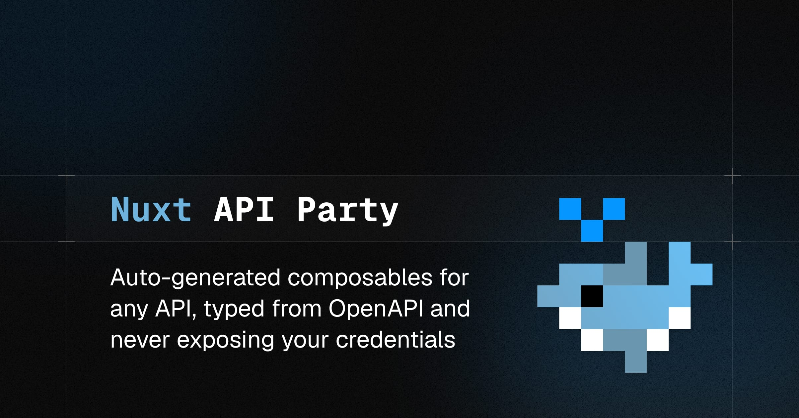

[](https://nuxt-api-party.byjohann.dev)

# Nuxt API Party

[Nuxt](https://nuxt.com) module to talk to APIs you don't control, with generated type-safe composables and a server proxy that keeps credentials off the client.

- [✨ &nbsp;Release Notes](https://github.com/johannschopplich/nuxt-api-party/releases)
- [📖 &nbsp;Read the documentation](https://nuxt-api-party.byjohann.dev)

## Features

- 🪅 [Auto-generated composables](https://nuxt-api-party.byjohann.dev/api/#generated-composables) for each API endpoint
- 🔒 Protected API credentials with Nuxt proxy route
- 🌐 No CORS issues
- 🍱 Familiar developer experience to [`useFetch`](https://nuxt.com/docs/api/composables/use-fetch) and `$fetch`
- 🧇 [Connect all your APIs](https://nuxt-api-party.byjohann.dev/essentials/getting-started#configure-your-first-api-endpoint)
- 🦾 Fully typed API clients from [OpenAPI specifications](https://nuxt-api-party.byjohann.dev/guides/openapi-integration)
- 🗃 Smart caching & hydration

## Setup

```bash
npx nuxt module add api-party
```

## Basic Usage

Add Nuxt API Party to your Nuxt configuration and describe your first API under the `apiParty` module option:

```ts
// `nuxt.config.ts`
export default defineNuxtConfig({
  modules: ['nuxt-api-party'],

  apiParty: {
    endpoints: {
      jsonPlaceholder: {
        url: process.env.JSON_PLACEHOLDER_API_BASE_URL!,
        // Global headers sent with each request
        headers: {
          Authorization: `Bearer ${process.env.JSON_PLACEHOLDER_API_TOKEN}`
        }
      }
    }
  }
})
```

If you were to call your API `jsonPlaceholder`, the generated composables are:

- `$jsonPlaceholder` – Returns the response data, similar to [`$fetch`](https://nuxt.com/docs/api/utils/dollarfetch#fetch)
- `useJsonPlaceholderData` – Returns [multiple values](https://nuxt-api-party.byjohann.dev/api/use-fetch-like#return-values) similar to [`useFetch`](https://nuxt.com/docs/api/composables/use-fetch)

Use these composables in your templates or components:

```vue
<script setup lang="ts">
const { data, refresh, error, status, clear } = await useJsonPlaceholderData('posts/1')
</script>

<template>
  <h1>{{ data?.title }}</h1>
  <pre>{{ JSON.stringify(data, undefined, 2) }}</pre>
</template>
```

> [!TIP]
> You can connect as many APIs as you want, just add them to the `endpoints` object.

The [documentation](https://nuxt-api-party.byjohann.dev) covers the OpenAPI integration, caching and every module option.

## 💻 Development

1. Clone this repository
2. Enable [Corepack](https://github.com/nodejs/corepack) using `corepack enable`
3. Install dependencies using `pnpm install`
4. Run `pnpm run dev:prepare`
5. Start development server using `pnpm run dev`

## Credits

- [Dennis Baum](https://github.com/dennisbaum) for sponsoring the initial version of this package.
- [Konkon](https://konkon.zip) for his logo pixel art.

## License

[MIT](./LICENSE) License © 2022-PRESENT [Johann Schopplich](https://github.com/johannschopplich) and © 2025-PRESENT [Matthew Messinger](https://github.com/mattmess1221)
