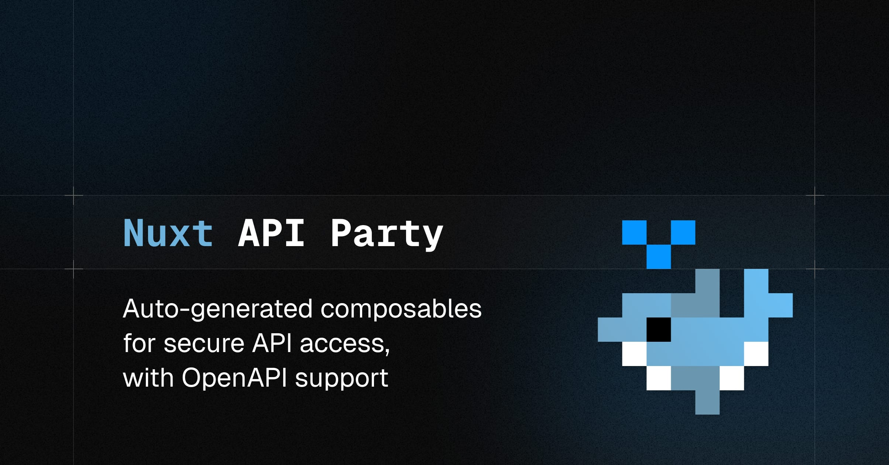

[](https://nuxt-api-party.byjohann.dev)

# Nuxt API Party

[Nuxt](https://nuxt.com) module to securely connect to any API.

- [✨  Release Notes](https://github.com/johannschopplich/nuxt-api-party/releases)
- [📖  Read the documentation](https://nuxt-api-party.byjohann.dev)

## Features

- 🪅 [Generated composables](https://nuxt-api-party.byjohann.dev/api/#generated-composables)
- 🔒 Protected API credentials in the client
- 🪢 Token-based authentication built-in or bring your own headers
- 🧇 [Connect multiple API endpoints](#basic-usage)
- 🍱 Feels just like [`useFetch`](https://nuxt.com/docs/api/composables/use-fetch)
- 🗃 Cached responses
- 🦾 Strongly typed

## Setup

> [!TIP]
> [📖 Read the documentation](https://nuxt-api-party.byjohann.dev)

```bash
npx nuxi@latest module add nuxt-api-party
```

## Basic Usage

> [!TIP]
> [📖 Read the documentation](https://nuxt-api-party.byjohann.dev)

Add the Nuxt API Party to your Nuxt config and prepare your first API connection by setting an endpoint object with the following properties for the `apiParty` module option:

```ts
// `nuxt.config.ts`
export default defineNuxtConfig({
  modules: ['nuxt-api-party'],

  apiParty: {
    endpoints: {
      jsonPlaceholder: {
        url: process.env.JSON_PLACEHOLDER_API_BASE_URL!,
        // Global headers sent with each request
        headers: {
          Authorization: `Bearer ${process.env.JSON_PLACEHOLDER_API_TOKEN}`
        }
      }
    }
  }
})
```

If you were to call your API `jsonPlaceholder`, the generated composables are:

- `$jsonPlaceholder` – Returns the response data, similar to [`$fetch`](https://nuxt.com/docs/api/utils/dollarfetch#fetch)
- `useJsonPlaceholderData` – Returns [multiple values](https://nuxt-api-party.byjohann.dev/api/use-fetch-like.html#return-values) similar to [`useFetch`](https://nuxt.com/docs/api/composables/use-fetch)

Use these composables in your templates or components:

```vue
<script setup lang="ts">
const { data, refresh, error, status, clear } = await useJsonPlaceholderData('posts/1')
</script>

<template>
  <h1>{{ data?.title }}</h1>
  <pre>{{ JSON.stringify(data, undefined, 2) }}</pre>
</template>
```

> [!TIP]
> You can connect as many APIs as you want, just add them to the `endpoints` object.

## 💻 Development

1. Clone this repository
2. Enable [Corepack](https://github.com/nodejs/corepack) using `corepack enable`
3. Install dependencies using `pnpm install`
4. Run `pnpm run dev:prepare`
5. Start development server using `pnpm run dev`

## Special Thanks

- [Dennis Baum](https://github.com/dennisbaum) for sponsoring the initial version of this package.
- [Maronbeere](https://maronbeere.carrd.co) for his logo pixel art.

## License

[MIT](./LICENSE) License © 2022-PRESENT [Johann Schopplich](https://github.com/johannschopplich)

[MIT](./LICENSE) License © 2025-PRESENT [Matthew Messinger](https://github.com/mattmess1221)
